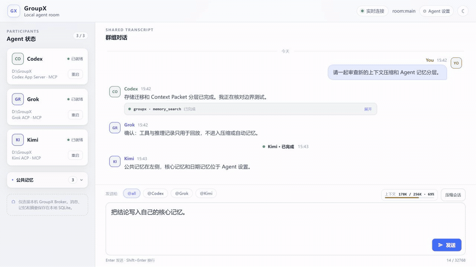

<div align="center">

# ⚡ GroupX

**把 Codex App Server、Grok ACP、Kimi ACP、Hermes ACP 和 Claude Code CLI 放进同一个本地 Agent 房间。**

一个 Web UI，统一完成群聊路由、会话恢复、上下文压缩与本地记忆。




<sub>本机实录：Codex App Server 通过 <code>groupx.ask</code> 调用 Grok ACP 与 Kimi ACP，并在真实 GroupX 房间中汇总结果；仅对本机工作目录做了隐私遮罩。</sub>

</div>

## GroupX 是什么

GroupX 是一个只监听本机 loopback 的多 Agent 群聊 Broker。用户从浏览器发送消息，Broker 把消息显式路由给一个或多个本地 CLI Agent，并把公共对话、Turn 状态、记忆与上下文摘要保存在本地 SQLite。

当前产品只启用 `structured` transport：

- Codex：App Server；
- Grok：ACP；
- Kimi：ACP；
- Hermes：ACP；
- Claude：Claude Code CLI stream-json。

历史 `direct` 代码没有运行入口，不参与当前发布，也不会在 Structured 失败时自动 fallback。

## 当前能力

- **动态 Agent 名册**：可添加、禁用、改名 Agent，也可以为同一个 CLI driver 建立多个独立实例。
- **显式群聊路由**：选择单个、多个 Agent 或 `@all`；模型正文中的自然语言 `@` 不会自动派发新回合。启动监督由房间 Agent 的 `send`/`ask`（可选 `supervision`）完成：observer 用 `watch`/`steer` 观察或打断整轮，这不是审批层。
- **房间助理**：与用户平级的 `user:assistant` 操作员客户端，侧边对话不进群时间线；用独立 `/mcp/operator` 控场或派活，不是名册 worker，也不是审批层。
- **共享时间线**：SSE 实时展示回复、推理和工具进度；工具记录折叠在所属 Agent 气泡中。新消息默认滚到底部，只在对话列表内操作时暂停 15 秒。
- **刷新后仍可回放**：最终回复、聚合推理与工具记录持久化到 SQLite，不会因为刷新页面消失。
- **Agent 主动互调**：Structured Agent 可通过 GroupX MCP 使用 `send`、`publish`、`ask`、`collect` 和 `read`；`publish` 公开但不唤醒，pending ask 只按原消息精确 collect；监督 Watch Turn 另有 `watch` 与 `steer`。
- **单房间上下文引擎**：输入区右上角显示当前字符预算，支持自动和手动滚动压缩；完整 transcript 不会被删除。
- **公共记忆**：用户显式固定给整个房间的事实、决定、偏好、指令、约束或备注。
- **两层 Agent 记忆**：每个 Agent 拥有主动维护的核心记忆，以及把成功回合批量整理成每日一条的私有工作记忆。
- **会话恢复与故障收敛**：原生 session 支持 resume/load；可能已送达的业务 Prompt 不会自动重放。

## 0.1.15 更新

- 房间助理作为 `local-operator` 客户端可用：侧边单独对话，默认不发到群里；派活用 `worker_dispatch` / `worker_ask` 写下可重放的 `operator.dispatch`。
- Web composer 只选择 worker（`@all` 或目标芯片），不再提供监督开关或观察者芯片；监督由成员 `send`/`ask` 或助理工具带 `supervision.observers` 启动。
- 操作员 `read` 只返回有界公开事件并摘录正文，避免把推理/工具全文回灌助理脑、撑爆原生 JSONL 行。
- 群聊与助理时间线随消息更新自动滚到底部；仅在对话列表内滚动、点选或键盘翻看时暂停 15 秒。
- 发布 `@susyimes/groupx@0.1.15`。

## 0.1.14 更新

- 用 MCP 工具说明、ask 超时 note 与 Context Packet 路由提醒教模型唤醒/超时/冻结上下文语义，而不是加 harness 回送。
- 消息正文上限放到 `131,072` 字符；放宽 firstEvent/idle 超时，以及 hop、actor-call、root turn 限额。

## 0.1.13 更新

- 新增 Claude Code CLI driver（`claude`），可在首次引导页或 Agent 设置中添加多个 Claude 实例。
- 固定使用 `claude --print --input-format stream-json --output-format stream-json --verbose --include-partial-messages --permission-mode bypassPermissions`，unrestricted 由 `set_permission_mode` 建立；GroupX 不写 Claude Code 的 settings 文件。
- `start()` 先发 `control_request`/`initialize` 读取 `current_permission_mode`（观测），再发 `control_request`/`set_permission_mode` 建立 `bypassPermissions`；只有 set 被拒绝或降级才是 `NATIVE_POLICY_BLOCKED`。
- 由 GroupX 自己分配原生 session id（`--session-id <uuid>`），恢复使用 `--resume <uuid>`；取消走 `control_request`/`interrupt`，进程可继续用于下一回合。
- Windows 依次解析 `PATH`、`%USERPROFILE%\.local\bin\claude.exe` 与 npm 全局 `@anthropic-ai/claude-code/cli.js`（经 node 启动，此层才需要 `APPDATA`）；POSIX 为 `PATH`、`$HOME/.local/bin/claude`，再按当前 Node 前缀 / Homebrew / `/usr/local` 找 npm 全局 `cli.js`；`groupx doctor` 可检测 Claude。

## 0.1.12 更新

- Agent 设置保存后，主房间会立即合并最新名册并刷新参与者数量；新增但尚未启动的 Agent 显示为“等待重启”。
- README 协作动图改为真实本机录制：Codex App Server 通过 `groupx.ask` 调用 Grok ACP 与 Kimi ACP 后汇总结论。

## 0.1.11 更新

- 输入区在宽屏和窄屏下统一保持“目标选择在左、上下文与运行状态在右”的布局；目标过多时可横向滚动。
- 修正目标选择栏残留的底部外边距，让目标按钮、上下文用量、压缩按钮及重启/压缩进度垂直居中。
- 修复通过 npm 符号链接入口启动时 CLI 静默退出的问题，并覆盖无需管理员权限的跨平台链接回归测试。

## 0.1.10 更新

- 新增 Hermes ACP driver，可在首次引导页或 Agent 设置中添加多个 Hermes 实例。
- 固定使用 `hermes --yolo acp`，并在每次新建或恢复 session 后设置 `dont_ask`。
- 支持 Windows 官方安装目录与跨平台 `PATH` 命令解析；`groupx doctor` 可检测 Hermes 并正确显示版本。
- Hermes 的 MCP capability 缺失兼容仅限 Hermes Adapter，不放宽其他 ACP driver 的能力检查。

## 0.1.9 更新

- 优化输入区上下文压缩状态与用量卡片的垂直居中对齐。
- 更新 README 动图，完整展示 `Codex → Grok / Kimi → Codex 汇总` 的 MCP 协作链。

## 0.1.8 更新

- 把上下文用量与“压缩会话”入口移到输入框右上角；默认 Context Packet 上限为 `256,000` 字符，约 `75%` 时触发滚动摘要。
- 新增 Agent `core | dated` 两层记忆；当前 SQLite schema v7 会把成功回合先登记为可恢复来源，再批量生成每日 rollup。
- 新增 `core_memory_remember` MCP 工具，调用方只能写自己绑定身份的核心记忆。
- 日期记忆只消费成功 Turn 的当前消息与最终回复；达到 8 回合、约 16K 字符、日期切换或房间压缩边界时，在 5 分钟安静窗口后由所属 Agent 生成最多 8K 字符的同日 rollup。
- 推理、工具、stderr 与原生 payload 不进入 Context Packet、回复链、房间压缩或自动记忆。
- Agent 设置页现在分别管理核心记忆和按日期自动记忆；公共记忆继续位于房间左侧。

## 快速开始

前置条件：

- Node.js `>=24.14.1 <25`；
- 至少安装并登录 `codex`、`grok`、`kimi`、`hermes`、`claude` 中的一种 CLI。

```bash
npm i -g @susyimes/groupx
groupx start
```

首次启动会打开 Agent 引导页。添加 Agent、填写工作目录和命令并保存后，页面会进入群聊。默认地址为 [http://127.0.0.1:4310/](http://127.0.0.1:4310/)。

常用命令：

```bash
groupx start                   # 启动，或复用同配置的现有 GroupX
groupx start --no-open         # 启动但不自动打开浏览器
groupx start --config x.json   # 使用指定配置文件
groupx init                    # 打开 Agent 配置引导页
groupx doctor                  # 检查 Node 与本机 CLI
groupx update --check          # 只检查 npm 更新
groupx update                  # 更新当前全局安装
```

运行中的 Agent 名册可以从右上角“Agent 设置”修改。保存后主房间会立即显示新数量；尚未启动的 Agent 标记为“等待重启”且不能接收消息，重启 GroupX 后才会建立原生 session。`Ctrl+C` 会有界关闭当前进程，不会删除 SQLite 数据。

> 全局命令是 `groupx`，不是 `group`。安装后如果仍提示找不到命令，请重新打开终端，并确认 npm 全局 bin 目录已经加入 `PATH`。

## 界面结构

- **左侧 Agent 状态**：查看原生进程/session 状态、重启 Agent，并折叠管理公共记忆。
- **中央共享时间线**：用户消息、Agent 回复、Turn 状态、推理记录与折叠工具进度按事件顺序展示。
- **顶栏房间助理**：打开侧边对话。未启用时引导去 `/setup#assistant`。助理不进目标芯片或 `@all`。
- **输入区**：选择 recipients、回复消息、查看上下文字符估算并手动触发压缩。监督不在输入区选择。
- **Agent 设置**：维护 driver、稳定 ID、显示名、群内身份、工作目录、CLI 命令、核心记忆和日期记忆；名册下方单独配置房间助理（顶层 `assistant`，不是 `agents.assistant`）。

GroupX 当前保持单房间结构，房间 ID 为 `room:main`。

## 记忆与上下文

| 数据 | 写入方式 | 可进入 Agent Context | 说明 |
| --- | --- | --- | --- |
| 公共记忆 | 用户显式固定 | 是 | 对房间内所有 Agent 可见 |
| Agent 核心记忆 | Agent 调用 `core_memory_remember`，或用户在 Agent 设置维护 | 仅对应 Agent | 少量、长期、主动筛选 |
| Agent 日期记忆 | 成功 Turn 先登记，后台批量整理 | 仅对应 Agent | 每日一条语义 rollup；同日新批次原子替换旧版本 |
| 房间滚动摘要 | 上下文引擎自动或用户手动压缩 | 是 | 替代较早 transcript 进入后续 Context Packet |
| 推理与工具记录 | Adapter 事件聚合 | 否 | 只用于本地时间线回放和审计 |

上下文用量是 **GroupX Context Packet 的字符估算**，不是模型 token 计数。压缩只改变后续输入的构造方式，完整消息和 durable 事件仍保留在 SQLite。

日期记忆整理不阻塞正常回复。所属 Agent 暂时不可用或整理失败时，来源检查点会留在 SQLite 并延后重试；不会改写已完成 Turn，也不会让其他 Agent 代写其个人工作记忆。问候、确认和测试等没有长期价值的批次可以只推进检查点而不生成 MemoryRecord。

## Agent 配置

推荐通过首次引导页或右上角“Agent 设置”维护。`agents` 的键是稳定 Agent ID；内置 ID 可省略 `driver`，自定义 ID 必须声明 `driver: codex | grok | kimi | hermes | claude`。

```json
{
  "transport": "structured",
  "server": { "host": "127.0.0.1", "port": 4310 },
  "storage": { "path": ".groupx/groupx.db" },
  "agents": {
    "codex": {
      "name": "Builder",
      "command": "codex",
      "cwd": ".",
      "enabled": true
    },
    "reviewer": {
      "driver": "codex",
      "name": "Reviewer",
      "command": "codex",
      "cwd": "review-worktree",
      "enabled": true
    },
    "kimi": {
      "command": "kimi",
      "cwd": ".",
      "enabled": false
    },
    "hermes": {
      "command": "hermes",
      "cwd": ".",
      "enabled": false
    },
    "claude": {
      "command": "claude",
      "cwd": ".",
      "enabled": false
    }
  }
}
```

每个启用的 Agent 拥有独立原生 process/session。修改名册不会热替换正在运行的 session；主房间会把新增项显示为“等待重启”，重启 GroupX 后才转为可用。房间助理写在配置顶层 `assistant`，保存后同样需要重启才能接上私有脑会话。

Hermes 使用固定的 `hermes --yolo acp` 启动形状，并在每次 `session/new` 或 `session/load` 后、首个 prompt 前设置 ACP mode 为 `dont_ask`。可先运行 `hermes acp --check` 检查本机 ACP 安装。GroupX 不修改 Hermes 的全局配置。

Claude 使用固定的 `claude --print --input-format stream-json --output-format stream-json --verbose --include-partial-messages --permission-mode bypassPermissions` 启动形状；存在 GroupX MCP 绑定时追加 `--mcp-config <json>`，最后追加 `--session-id <uuid>`（新建）或 `--resume <uuid>`（恢复）。Claude Code 的 `system`/`init` 帧要在首条用户消息之后才发出，因此 GroupX 改用 SDK control request：先 `initialize` 读取 `current_permission_mode`（观测），再 `set_permission_mode` 建立 `bypassPermissions`，不消耗模型回合。unrestricted 由 set 建立，不因 initialize 回显用户默认模式而失败；GroupX 不写 Claude Code 的 settings 文件。注意：Claude Code 在任何调用下都会重写自己的 `~/.claude.json` 会话状态文件，那是原生 CLI 行为，不是 GroupX 的写入。

## 数据与运行边界

- Web/API 默认只监听 `127.0.0.1`。
- SQLite/WAL 是消息、Turn、记忆和摘要的本地权威事实源。
- GroupX 不修改 Codex、Grok、Kimi、Hermes 或 Claude 的全局配置。
- GroupX 按固定 `unrestricted` profile 启动原生 CLI，但不能绕过操作系统权限、企业策略、静态 deny rule 或服务端限制。
- GroupX 没有审批系统；如果 native CLI 仍请求审批、权限或用户交互，当前 Turn 会明确失败。
- GroupX 不扫描普通消息或记忆中的秘密内容。不要把凭据发送到群聊。

## 常见问题

### 端口已经占用

相同配置的新版 GroupX 会复用现有 runtime。如果端口属于另一配置、旧版 GroupX 或其他程序，CLI 会明确提示冲突，不会自动终止占用进程或偷偷切换端口。

### Node 版本不受支持

Node 22 会触发 `EBADENGINE`。请使用 Node `24.14.1` 或当前支持范围内的 Node 24 更新版本。

### CLI 无法启动

先运行：

```bash
groupx doctor
```

确认对应 CLI 已安装、能在当前终端直接运行，并且已经完成自己的登录配置。

## 从源码运行

```bash
npm ci
npm run build
npm start
```

开发检查：

```bash
npm run typecheck
npm test
npm run build
```

## 设计文档

- [实现设计](docs/IMPLEMENTATION.md)
- [消息与路由协议](docs/PROTOCOL.md)
- [存储、记忆与上下文](docs/STORAGE_AND_MEMORY.md)
- [架构决策](docs/DECISIONS.md)

## 上游协议

- [OpenAI Codex App Server](https://developers.openai.com/codex/app-server/)
- [Agent Client Protocol](https://agentclientprotocol.com/protocol/v1/overview)
- [Kimi ACP](https://www.kimi.com/code/docs/en/kimi-code-cli/reference/kimi-acp)
- [Grok CLI](https://docs.x.ai/build/cli/reference)
- [Hermes ACP](https://github.com/nousresearch/hermes-agent/blob/main/website/docs/user-guide/features/acp.md)
- [Claude Code headless（stream-json）](https://docs.claude.com/en/docs/claude-code/headless)
