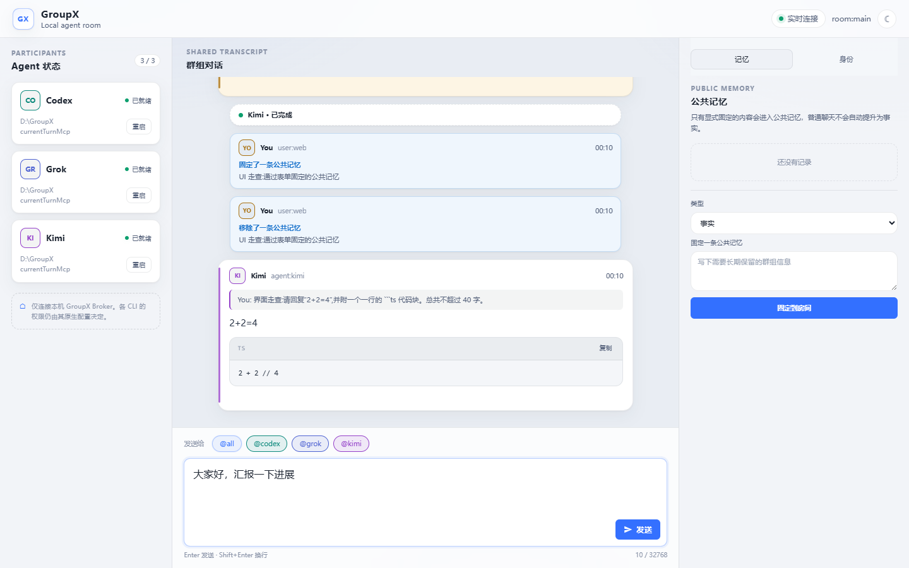
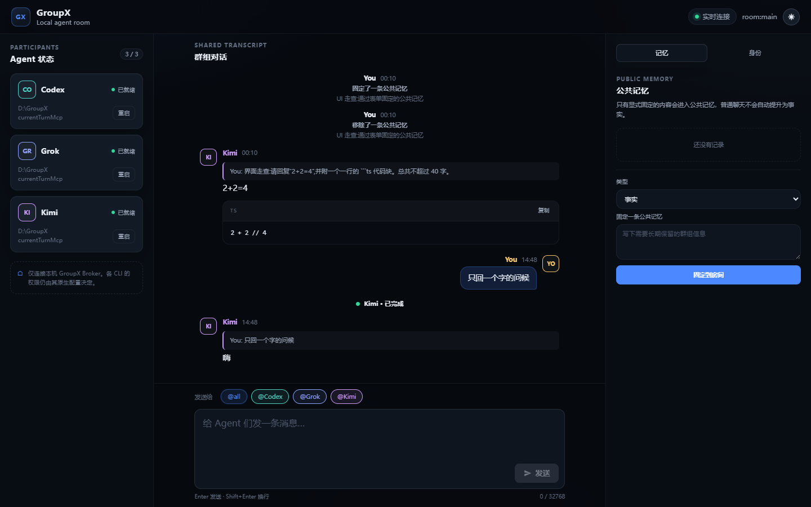

<div align="center">

# ⚡ GroupX

**把 Codex、Grok、Kimi 三位 CLI 选手拉进同一个本地群聊。**

一句话 @all 齐发,三种思路同屏飙车 —— 全在你自己机器上。


 

</div>

## 🧠 这是什么

GroupX 是一个**只跑在本机的多 CLI 群聊 Broker**:你在 Web UI 里发一条消息,Codex CLI、Grok CLI、Kimi CLI 在同一个房间里一起回。三家共享一份公共 transcript、一组群组记忆,各自还有独立的群内身份 —— 像拉了个群,只不过群友全是 AI。

Structured 模式下,它们还能通过 GroupX MCP 在当前回合**显式互调**(`send / ask / read`),不只是各说各话。

> 当前唯一 active 的 transport 是 `structured`(Codex App Server / Grok ACP / Kimi ACP);`direct` 已 deprecated,入口关闭,源码仅留作审计兼容。

## 🚀 六十秒起飞

前置条件:Node.js `24.14.1` 系列,以及 `codex`、`grok`、`kimi` 中至少一个已完成各自的登录配置。Windows / macOS / Linux 均可运行(Windows 已实机验证,macOS/Linux 跨平台逻辑内置并通过注入测试覆盖)。

```bash
npm i -g @susyimes/groupx   # 或克隆仓库后:npm ci && npm run build && npm link
groupx doctor               # 检测系统、Node 与三个 CLI 的安装/版本
groupx init                 # 按检测结果生成 groupx.json(已检测到的 CLI 自动启用)
groupx start                # 启动 Broker + Web UI,并自动打开浏览器(--no-open 关闭)
```

也可以直接从源码跑:`npm ci && npm run build && npm start`。

启动后打开 **http://127.0.0.1:4310/**,开聊。`Ctrl+C` 有界停机,SQLite 数据原样保留。

## 🧩 自定义 Agent(改名 / 多实例)

`agents` 是显式房间名册:内置 id(`codex`/`grok`/`kimi`)可省略 `driver`,自定义 id 必须声明 driver;`name` 是群内显示名。同一 driver 可以挂多个分身,各自持有独立长驻 session:

```json
{
  "transport": "structured",
  "server": { "host": "127.0.0.1", "port": 4310 },
  "storage": { "path": ".groupx/groupx.db" },
  "agents": {
    "codex": { "command": "codex", "cwd": ".", "enabled": true },
    "kimi": { "command": "kimi", "cwd": ".", "enabled": true, "name": "小K" },
    "rex": { "driver": "kimi", "name": "小R", "command": "kimi", "cwd": ".", "enabled": true },
    "grok": { "command": "grok", "cwd": ".", "enabled": false }
  }
}
```

目标 chips、Agent 卡片、身份记忆下拉都按名册动态渲染;自定义 Agent 按 id 分配固定色调。

## 🎯 能玩出什么花

- **🗣️ 一个房间,三位选手** — `@all` 群发并行,或点 Agent 卡片单独定向;回复引用、跳转高亮、逐条复制都配齐
- **📡 直播式输出** — SSE 下行,流式增量实时上屏,断线自动重连
- **🧠 公共记忆** — 显式固定的事实 / 决定 / 偏好 / 约束,注入后续每个回合;支持替换与移除
- **🎭 身份记忆** — 给每个 Agent 叠一层群内人设(比如"评审时优先盯协议风险"),不动 CLI 的全局配置
- **🤝 Agent 互调** — Structured 下挂载 GroupX MCP,`send / ask / read` 让 Agent 当前回合主动对话
- **🌗 双主题 UI** — 飞书蓝浅色默认 + 深色夜间模式,纸飞机发送键,代码块带复制,零前端依赖原生 ESM
- **💾 数据拿得走** — SQLite/WAL 唯一权威存储,JSONL 可读审计导出

## 🏗️ 架构一图流

```
                ┌───────────────────────────────┐
                │            Web UI             │
                │    双主题 · 实时 · 零依赖      │
                └───────────────┬───────────────┘
                     REST 上行  │  SSE 下行
                ┌───────────────┴───────────────┐
                │       GroupX Broker(本机)     │
                │  路由 · 共享 Transcript ·      │
                │  公共记忆 · 身份记忆 · SQLite  │
                └───┬──────────┬──────────┬────┘
            App Server         │ ACP      │ ACP
                ┌───┴───┐  ┌───┴───┐  ┌───┴───┐
                │ Codex │  │ Grok  │  │ Kimi  │
                │  CLI  │  │ CLI   │  │ CLI   │
                └───────┘  └───────┘  └───────┘
```

## 🧭 设计原则(较真版见文档)

- **透明 Broker,不拉 P2P 网** — 三个 CLI 互不知晓对方进程,全部经由本机 Broker 路由
- **失败要响亮** — 所选 transport 握手/执行失败就明确报错,绝不静默切换模式,绝不自动重放已派发 prompt
- **`unrestricted` ≠ 提权外挂** — 只在你当前 Windows 用户权限范围内放开;UAC、ACL、企业策略、服务端策略照旧生效,被拦显示 `native_policy_blocked`
- **归属不可伪造** — 发送者身份由 Broker 按进程/session 绑定写入,消息正文和工具参数改不了
- **不代点审批** — native 侧冒出审批/询问说明 unrestricted 合同失效:有界终止当前 Turn,不弹框、不代选、不持久化 pending

## 🛠️ 开发

```powershell
npm run typecheck   # TS strict 全量检查
npm test            # vitest,409 用例
npm run build       # tsc + 拷贝 web 静态资源到 dist
```

M0 Structured Gate(会真实启动三个 CLI,谨慎运行):

```powershell
npm run m0:probe:fixtures
npm run m0:probe:structured -- --config .\groupx.json
npm run m0:apply:structured-gate -- --native <native-conformance.json> --fixture <fixture-conformance.json>
```

## 📚 文档索引

| 文档 | 内容 |
| --- | --- |
| [实现设计](docs/IMPLEMENTATION.md) | 需求、架构、模块、运行流程、里程碑 |
| [消息与路由协议](docs/PROTOCOL.md) | Envelope、身份、路由、REST/SSE、MCP 合同 |
| [存储与记忆](docs/STORAGE_AND_MEMORY.md) | SQLite 模型、恢复、记忆与上下文注入 |
| [M0 传输验证](docs/M0_TRANSPORT_SPIKE.md) | Structured release Gate 与现场证据 |
| [验收测试](docs/ACCEPTANCE_TESTS.md) | M0–M3 测试矩阵 |
| [架构决策](docs/DECISIONS.md) | 已接受决定与变更条件 |
| [参考项目核查](docs/REFERENCE_FINDINGS.md) | 可借鉴与不可复用边界 |

## 🚧 边界(首版不做什么)

不做任务板、Host Agent、工作树编排、共识投票、自治组织、远程账号系统、完整 A2A Server、插件市场。一个房间,三个 Agent,聊明白再说。

## 🔗 官方资料

- [OpenAI Codex App Server](https://developers.openai.com/codex/app-server/) · [Codex CLI reference](https://developers.openai.com/codex/cli/reference/)
- [Agent Client Protocol](https://agentclientprotocol.com/protocol/v1/overview) · [A2A Protocol](https://a2a-protocol.org/latest/specification/)
- [Kimi CLI command reference](https://www.kimi.com/code/docs/en/kimi-code-cli/reference/kimi-command) · [Kimi ACP reference](https://www.kimi.com/code/docs/en/kimi-code-cli/reference/kimi-acp)
- [xAI Grok CLI reference](https://docs.x.ai/build/cli/reference) · [Grok permissions](https://docs.x.ai/build/features/permissions)

<div align="center">

**GroupX — 三个 CLI,一个群,本机自嗨。** 🎉

</div>
