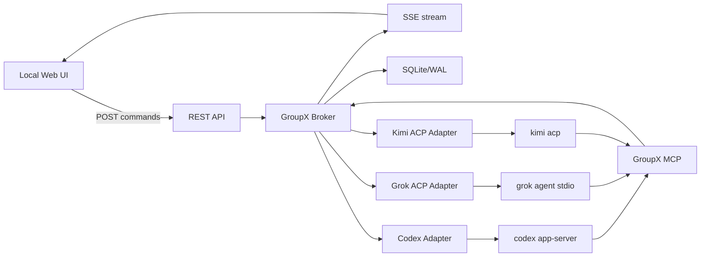
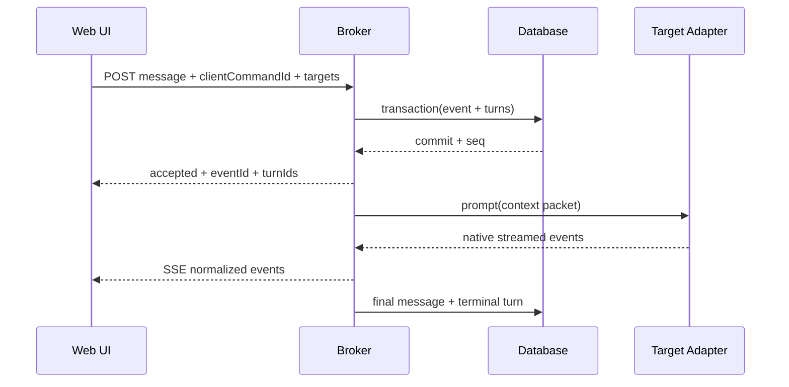

# GroupX 实现设计

状态：Draft v0.1
日期：2026-08-11
适用里程碑：M0-M3

## 1. 产品定义

GroupX 是一个本地、单用户、单房间优先的多 CLI 群聊系统。它负责：

- 将 Web UI、Codex CLI、Grok CLI、Kimi CLI 接入同一房间；
- 让用户定向或并行唤醒一个或多个 CLI；
- 让 CLI 通过显式 GroupX 工具调用相互发送消息；
- 持久化消息、会话、公共记忆和身份记忆；
- 透传各 CLI 的原生事件、错误、取消和审批请求；
- 在不替换内部协议的前提下，为以后接入 A2A 或新 CLI 保留边界。

GroupX 不是模型网关、权限系统、任务编排平台或自治组织运行时。

### 1.1 威胁模型

M0-M2 假设：单一可信 Windows 用户在本机启动 GroupX 与三套 CLI。GroupX 防止普通协议调用和模型正文伪造 sender，限制远程网页调用本地接口，并对模型输出做渲染消毒。

GroupX 不声称抵御已经拥有本机任意进程执行、调试权限或数据库写权限的恶意程序。解决这种威胁需要系统级鉴权、进程隔离或能力令牌，会改变“本机单用户、无额外权限层”的产品边界。

## 2. 需求追踪

| ID | 用户需求 | 实现合同 | 主要验收 |
| --- | --- | --- | --- |
| R1 | 本地 Web UI 与三套 CLI 群聊 | REST 命令、SSE 事件、三个持续会话 Adapter | UI 可定向发送并看到并行流式回复 |
| R2 | CLI 可以互相沟通 | 会话级 GroupX MCP 工具 + 明确寻址的内部 Envelope | Codex 可显式发给 Grok，Grok 回复链可见 |
| R3 | 不增加门禁，权限取决于 CLI 配置 | 不传模型/沙箱/审批覆盖；原生请求只透传 | 启动审计无覆盖参数，配置前后不变 |
| R4 | 公共群组记忆、身份记忆 | 版本化 MemoryRecord、IdentityRecord、来源引用 | 重启后可检索且来源可追溯 |
| R5 | 简单、方便扩展 | 单 Broker、统一 Adapter、统一 Envelope、单数据库 | 新增 Adapter 不修改核心路由和存储合同 |
| R6 | 能识别真实发送者 | Adapter/会话通道绑定，Broker 生成 actor | 正文自称他人不改变 UI 发送者 |
| R7 | 透明转发效率可接受 | 跨 Agent 并行、每 Agent 单飞、增量上下文、delta 不落库 | Broker 本地开销达到性能目标 |

## 3. 明确不做

M0-M2 不实现：

- 三个 CLI 之间的物理 P2P 网状连接；
- 远程账号、登录、组织、RBAC 或额外审批策略；
- Agent Host、工作树分配、任务板、共识、投票、自治循环；
- 自动从自然语言正文解析 `@某人` 并触发下一轮；
- 自动将模型总结提升为稳定事实或身份；
- 远程 A2A Agent Card、Task/Artifact 生命周期；
- 多房间、多用户、移动端或互联网暴露；
- 二进制大文件通过群消息正文传输。

## 4. 总体架构



### 4.1 运行拓扑

M0-M2 使用一个 GroupX Node.js 主进程：

- 主进程拥有 HTTP/SSE 服务器；
- 主进程拥有 SQLite 连接和唯一写入权；
- 主进程启动并监控三个 CLI 子进程；
- 每个 CLI 子进程有独立 Adapter、协议解析器、状态机、超时和队列；
- GroupX MCP 运行在同一主进程中，并为每个 CLI 会话建立独立调用方绑定；
- Browser 和 CLI 不直接打开数据库。

CLI 退出不会使 Broker 退出；数据库异常属于 Broker 级故障，应停止接受新命令并保留明确健康状态。

### 4.2 为什么不是物理 P2P

三套 CLI 当前暴露的是客户端与 Agent 的持续会话接口，而不是同构的 Agent-to-Agent Server。强行 P2P 仍需给每个 CLI 增加代理服务，还会引入 N² 连接、记忆复制和冲突处理。

透明 Broker 的额外成本是一次本地协议解析和一次持久化提交。模型网络与推理通常是主耗时。GroupX 通过并行派发、单写者数据库、delta 批量推送和增量上下文控制本地开销。

## 5. 核心模块

### 5.1 Broker

职责：

- 接受经过校验的 Command；
- 在事务中写入源事件和目标 Turn；
- commit 后并行交给目标 Agent lane；
- 归一化 Adapter 事件并广播给 SSE/UI；
- 管理取消、关闭、恢复和健康状态；
- 维护 `correlationId`、`causationId` 和投递游标。

Broker 不负责：

- 决定某个 CLI 是否可以执行命令；
- 修改 CLI 权限；
- 根据消息内容猜测发送者；
- 从普通模型文本自动触发另一个 Agent。

### 5.2 Adapter Registry

核心只依赖统一接口：

```ts
type AdapterId = "codex" | "grok" | "kimi" | string;

interface CliAdapter {
  readonly adapterId: AdapterId;
  probe(): Promise<CapabilityReport>;
  start(input: StartInput): Promise<NativeSession>;
  resume(input: ResumeInput): Promise<NativeSession>;
  prompt(session: NativeSession, input: PromptInput): AsyncIterable<NativeEvent>;
  cancel(session: NativeSession, nativeTurnId: string): Promise<CancelResult>;
  close(session: NativeSession): Promise<void>;
  health(): AdapterHealth;
}
```

Adapter 必须把原生事件转换为 GroupX 事件，不允许核心读取 Codex、Grok 或 Kimi 的私有 wire shape。

必需能力：

- `initialize/start session`
- `prompt`
- `stream event`
- `terminal event`
- `cancel or explicit unsupported`
- `close`
- `transport failure`

可选能力：

- 原生 resume/load；
- MCP server 注入；
- 原生 approval request；
- tool/progress 细粒度事件；
- session history read。

可选能力必须来自现场 capability report，不能根据 CLI 名称硬编码为一定可用。

### 5.3 Identity Binding

Broker 启动 Adapter 时创建：

```text
actorId        稳定群内身份，例如 agent:codex
instanceId     本次 Adapter 进程实例
bindingId      GroupX 内部会话绑定
nativeSession  CLI 返回的 thread/session 标识
```

所有从该协议流或专属 MCP binding 进入的事件都由 Broker 写入 `actorId`。`groupx.send` 不接受 `from` 字段。

显示名称、头像、角色可以修改，但不可变来源字段不能由 Agent 修改。多实例使用 `agent:codex/main`、`agent:codex/reviewer` 等稳定 ID 区分。

### 5.4 Dispatcher 与 Agent Lane

- 每个 native session 默认同时只允许一个 active turn；
- 不同 Agent lane 可以并行；
- `@all` 生成三个独立 Turn 行和三个独立 correlation child；
- 一个 Agent 超时或失败不取消其他 Agent；
- 每个 Turn 有明确的 queued/running/terminal 状态；
- 默认不自动重试正在执行时中断的模型 Turn。

后续若某 Adapter 宣称同一 session 支持并发 turn，也不能直接开启；必须新增独立验证和顺序语义决策。

### 5.5 Event Store

SQLite/WAL 保存：

- 不可变语义事件；
- 持久 Turn 状态；
- Session 与 Adapter capability snapshot；
- Actor/Instance/Binding；
- 投递游标；
- 公共记忆、身份记忆及其版本关系。

数据库细节见 [STORAGE_AND_MEMORY.md](STORAGE_AND_MEMORY.md)。

### 5.6 Memory Service

Memory Service 提供：

- 显式记忆写入；
- 作用域与来源校验；
- supersede/retract；
- 按 scope/kind/text/cursor 检索；
- 生成有明确 `summary` 标签的滚动摘要；
- 为 Adapter 构建受长度预算约束的 Context Packet。

Memory Service 不允许摘要覆盖原始 transcript，也不把其他 Agent 对某身份的描述直接写成该身份的稳定事实。

### 5.7 GroupX MCP

M0/M2 的最小工具面：

```text
groupx.send
groupx.ask
groupx.read
groupx.memory.search
groupx.memory.remember
groupx.identity.read
groupx.identity.remember
```

工具调用方来自 session binding。Agent 只能以自己的 actor 身份写 identity record；Web UI 可以为任意 Agent 写用户来源的 identity record。

`groupx.send` 持久化后异步返回；`groupx.ask` 等待目标 terminal response 并将结果带回当前 CLI 回合；`groupx.read` 查询异步 correlation。同步 ask 遇到 active causal stack 中的祖先 Agent 时返回 `CAUSAL_CYCLE`，避免相互等待死锁。

### 5.8 Web/API

REST 负责有副作用的用户命令；SSE 负责服务端事件流。

建议端点：

| Method | Path | 作用 |
| --- | --- | --- |
| GET | `/api/health` | Broker、数据库和 Adapter 健康 |
| GET | `/api/bootstrap` | 当前房间投影、Agent、游标和能力摘要 |
| GET | `/api/events?afterSeq=` | SSE 增量事件；支持 `Last-Event-ID` |
| POST | `/api/messages` | 用户定向消息或 `@all` |
| POST | `/api/turns/:id/cancel` | 请求原生取消 |
| POST | `/api/approvals/:id/resolve` | 返回原生可用 decision |
| GET | `/api/memory` | 查询公共/身份记忆 |
| POST | `/api/memory` | 用户显式固定记忆 |
| POST | `/api/memory/:id/supersede` | 追加替代版本 |
| POST | `/api/memory/:id/retract` | 撤回当前版本 |
| POST | `/api/agents/:id/restart` | 重启单个 Adapter |

所有 POST 命令接受 `clientCommandId`，重复提交必须返回原命令结果，不能重新派发。

### 5.9 Web UI

M1 UI 使用原生 HTML/CSS/TypeScript，避免在首版引入大型框架。

布局：

- 左侧：Codex/Grok/Kimi 状态、cwd、会话状态、能力与重启按钮；
- 中间：群聊、发送者徽标、reply/forward、目标选择和取消；
- 右侧：公共记忆、身份记忆和原生审批请求；
- 底部：composer，明确选择 `@codex/@grok/@kimi/@all`。

UI 只根据 Envelope actor 渲染发送者，不解析正文决定头像或身份。
所有模型 Markdown/HTML 必须经过消毒；非本地 Origin 不允许调用 API。这里属于本地传输与渲染安全，不改变 CLI 权限。

## 6. 关键消息流程

### 6.1 用户定向消息



`@all` 只改变 targets 数量；三个 Adapter prompt 在 commit 后并行启动。

### 6.2 CLI 发给另一个 CLI

1. Codex 在自己的会话内调用 `groupx.send(to=["grok"], content=...)`。
2. GroupX MCP 根据 binding 将 `from` 固定为 `agent:codex`。
3. Broker 在同一事务中追加 message 和 Grok Turn。
4. Grok Adapter 获得目标消息及必要的增量上下文。
5. Grok 的普通回复显示在房间中，但不会自动再次唤醒 Codex。
6. 若 Grok 要继续对 Codex 发起新 turn，必须显式调用 `groupx.send`。

若 Codex 必须在当前工具调用中直接获得 Grok 的回复，则使用 `groupx.ask`。问题和回答仍对房间可见，ask 的工具结果只是将已持久化的目标回复带回调用者当前上下文。

### 6.3 原生审批请求

1. Adapter 收到 CLI 的 server-initiated permission/approval request。
2. Broker 创建待处理状态，SSE 将原生 request 类型和可用 decisions 交给 UI。
3. UI 只显示 CLI 实际提供的选项。
4. 用户选择后，Broker 返回对应原生 decision。
5. 超时、UI 断开或 Broker 重启绝不转换为自动允许。

是否持久化命令正文取决于脱敏规则；至少保存 request ID、来源、关联 turn、状态和结果，原始敏感 payload 不进入长期日志。

### 6.4 Broker 重启

1. 打开数据库并恢复非终态 Session/Turn。
2. `queued` Turn 可以安全重新加入相应 lane。
3. `running` Turn 标记为 `interrupted`，先尝试查询/恢复原生 session。
4. 无法确认原生执行状态时，保持 `unknown_after_restart`，不盲目重发。
5. Adapter 支持原生 resume/load 时恢复；否则建立新原生会话并通过 GroupX Context Packet 恢复群组上下文。

GroupX 只承诺命令接收与派发记录幂等，不虚构模型执行的 exactly-once。

## 7. 上下文策略

每个 Adapter 维护 `lastDeliveredSeq`。一次 prompt 的 Context Packet 最多包含：

1. GroupX 协议与当前 actor 身份的简短说明；
2. 与当前 actor 相关的身份记忆摘要；
3. 当前有效的固定公共记忆；
4. 自上次投递后的相关消息增量；
5. 当前目标消息和 reply chain；
6. 必要时的滚动摘要引用。

不把完整数据库或完整房间历史重复注入每个 turn。Context Packet 有字符/token 预算，截断顺序必须保留当前消息和明确 reply chain。

## 8. 并发、性能与背压

### 8.1 并发规则

- Broker 命令接收可并发；数据库写入以事务序列化关键不变量；
- 每个 Agent lane 单飞；
- 不同 Agent lane 并行；
- 可见性与唤醒分离：消息默认全房间可见，`to` 只决定谁得到 Turn；
- SSE 对每个浏览器连接有有界发送队列；
- 慢浏览器只能丢弃可重建的 delta，不能丢 durable terminal event；
- 大正文设长度上限，大文件以本地路径/引用事件传递。
- 每个根 correlation 记录 hop/Agent Turn 数；达到配置上限时创建公开的 `routing.loop_stopped`，不静默丢弃。

### 8.2 Delta 规则

- `content.delta` 是瞬时事件，直接批量推送到 UI；
- 默认按很短时间窗或字符阈值合并，避免逐 token JSON/DOM 操作；
- durable store 只保存最终 message、turn terminal 和必要 tool summary；
- 浏览器重连后从 durable seq 恢复，不能恢复未落库的历史 token delta，但能得到最终 message。

### 8.3 初始性能目标

以下不包含模型网络和推理时间：

| 指标 | M1 目标 |
| --- | --- |
| POST 命令接受 p95 | 小于 50 ms |
| commit 后进入目标 Adapter 队列 p95 | 小于 25 ms |
| durable event SSE 可见 p95 | 小于 100 ms |
| 三目标 fan-out | 并行启动，不按 Agent 串行等待 |
| 10,000 条文本事件 bootstrap | 不全量发送；使用投影与游标 |

目标必须由本机基准验证；未测前不得写成已达到。

## 9. 故障模型

核心错误码建议：

```text
ADAPTER_NOT_FOUND
ADAPTER_START_FAILED
PROTOCOL_HANDSHAKE_TIMEOUT
PROTOCOL_INVALID_MESSAGE
SESSION_NOT_AVAILABLE
NATIVE_RESUME_UNSUPPORTED
TURN_FIRST_EVENT_TIMEOUT
TURN_IDLE_TIMEOUT
TURN_CANCEL_TIMEOUT
TURN_INTERRUPTED
APPROVAL_REQUEST_EXPIRED
MCP_BINDING_MISMATCH
STORE_UNAVAILABLE
STORE_CONFLICT
CLIENT_COMMAND_CONFLICT
CONTEXT_BUDGET_EXCEEDED
SECRET_REDACTED
```

错误事件必须带 `adapterId/instanceId/correlationId`，但不能附带完整环境变量或未脱敏 stderr。未知原生事件应记录 schema 摘要并继续，除非它破坏协议同步。

## 10. 配置合同

首版配置只允许指定运行位置和非权限型参数：

```json
{
  "server": {
    "host": "127.0.0.1",
    "port": 4310
  },
  "storage": {
    "path": ".groupx/groupx.db"
  },
  "agents": {
    "codex": { "command": "codex", "cwd": "D:\\GroupX" },
    "grok": { "command": "grok", "cwd": "D:\\GroupX" },
    "kimi": { "command": "kimi", "cwd": "D:\\GroupX" }
  }
}
```

M0 不开放任意 `extraArgs` 或 env dump，以免绕过“不覆盖 CLI 配置”的合同。Adapter 自己追加且只追加协议启动子命令。

子进程：

- 使用 argv 数组，不经过 shell；
- Windows 设置 `windowsHide: true`；
- 继承当前用户环境，但绝不记录完整环境；
- stdout 只用于协议，stderr 独立、限长、脱敏；
- 关闭时先发原生 cancel/close，再按限定时间终止该 Adapter 进程树。

## 11. 项目结构

```text
D:\GroupX
├─ README.md
├─ AGENTS.md
├─ package.json                 # M0 创建
├─ src
│  ├─ main.ts
│  ├─ core
│  │  ├─ broker.ts
│  │  ├─ dispatcher.ts
│  │  ├─ envelope.ts
│  │  ├─ identity-binding.ts
│  │  └─ errors.ts
│  ├─ supervisor
│  │  └─ process-supervisor.ts
│  ├─ adapters
│  │  ├─ types.ts
│  │  ├─ codex-app-server.ts
│  │  ├─ grok-acp.ts
│  │  └─ kimi-acp.ts
│  ├─ storage
│  │  ├─ store.ts
│  │  ├─ sqlite-store.ts
│  │  └─ migrations
│  ├─ memory
│  │  ├─ service.ts
│  │  └─ context-packet.ts
│  ├─ mcp
│  │  └─ server.ts
│  ├─ observability
│  │  ├─ redaction.ts
│  │  └─ metrics.ts
│  └─ web
│     ├─ api.ts
│     └─ sse.ts
├─ web
│  ├─ index.html
│  ├─ app.ts
│  └─ styles.css
├─ tests
│  ├─ fixtures
│  ├─ unit
│  ├─ integration
│  └─ e2e
├─ docs
└─ .groupx                       # runtime, ignored
```

## 12. 实施里程碑

### M0：传输验证

- 建立 TypeScript 测试 harness；
- 对三个本机 CLI 做真实初始化、持续会话、stream、cancel、resume/load 和 MCP/approval 能力探测；
- 保存脱敏 capability matrix；
- 验证启动参数和 CLI 配置文件未被修改；
- 固定 Adapter 接口和事件归一化合同。

详细合同见 [M0_TRANSPORT_SPIKE.md](M0_TRANSPORT_SPIKE.md)。

### M1：本地群聊闭环

- Broker、SQLite migrations、durable turns；
- REST/SSE；
- 原生 Web UI；
- 用户定向消息、`@all` 并行、流式显示；
- cancel、failure、restart 和 sender badge；
- 基础性能测试。

### M2：CLI 互发与记忆

- 会话绑定的 GroupX MCP；
- `groupx.send/ask/read` 与同步因果循环检测；
- 公共记忆、身份记忆、版本和 provenance；
- Context Packet 与 delivery cursor；
- Broker 重启后 session 恢复或明确降级；
- 原生 approval UI 透传。

### M3：扩展边界

- Adapter 插件注册；
- A2A 边缘 Adapter；
- 多房间的 schema 准备，不必开放多用户；
- 可选全文检索与审计 JSONL 导出；
- 大型 artifact 引用传递。

## 13. 完成标准

跨里程碑的详细测试编号和 Gate 见 [ACCEPTANCE_TESTS.md](ACCEPTANCE_TESTS.md)。

GroupX v0.1 完成必须同时满足：

1. Web UI 可以选择任意一个或 `@all` 并看到流式回复。
2. Codex 可以通过 `groupx.send` 发给 Grok，Grok 可以显式回复 Codex；Codex 也可以通过 `groupx.ask` 在当前工具结果中获得 Grok 的 terminal response。
3. 三个 Agent 的 sender identity 由会话绑定确认，正文伪装不会改变 UI 归属。
4. 同一 Agent 顺序稳定，不同 Agent 并行；一个失败不阻塞其他两个。
5. 重复 `clientCommandId` 不重复创建 Turn。
6. Broker 重启后恢复消息、公共记忆、身份记忆和 session capability；原生 resume 不可用时明确降级。
7. GroupX 启动命令没有模型、沙箱、审批或自动允许覆盖，CLI 配置文件前后不变。
8. 原生 approval request 只透传原生选项，不自动批准。
9. 日志、数据库和测试证据不包含凭据或完整配置正文。
10. Broker 本地延迟、10,000 事件投影和三路 fan-out 达到记录的性能门槛。

## 14. 当前未决但不阻塞架构的问题

- SQLite 稳定驱动的具体包与版本：M0 安装/性能 smoke 后锁定；不直接依赖本机仍标 experimental 的 `node:sqlite`。
- Grok/Kimi 对 `session/load`、MCP server 和 permission request 的真实支持程度：由 M0 capability matrix 决定。
- Codex GroupX MCP 的最佳会话级注入方式：优先使用稳定 MCP 配置路径；不依赖 experimental `dynamicTools`。
- approval payload 的可持久化字段白名单：M1 前完成脱敏 fixture 测试。
- Agent 显式互发形成长链时的 hop/root-turn/queue 限制具体默认值：M2 根据真实运行证据固定；是否存在这些可靠性边界已确定，不把自然语言解析当作解决方案。
