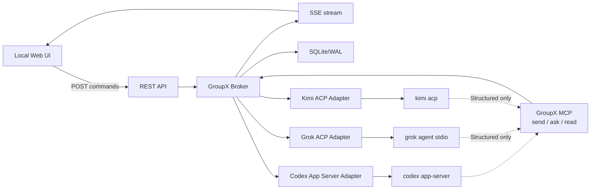
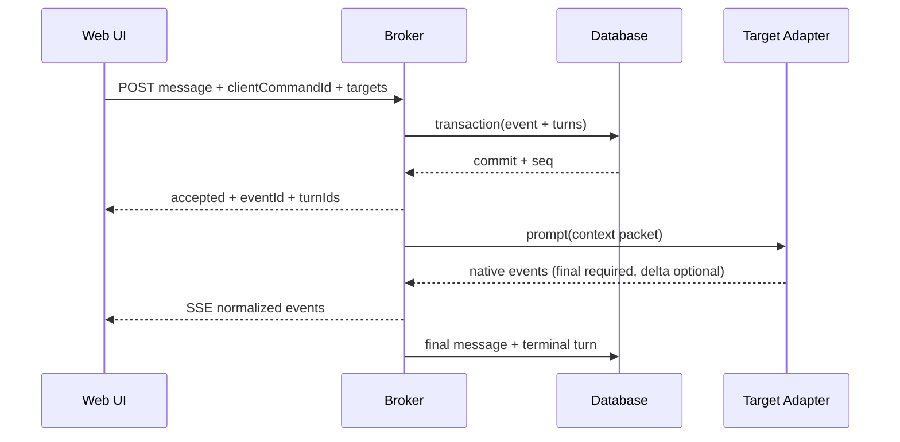

# GroupX 实现设计

状态：Draft v0.1
日期：2026-08-11
适用里程碑：M0-M3

## 1. 产品定义

GroupX 是一个本地、单用户、单房间优先的多 CLI 群聊系统。它负责：

- 将 Web UI、Codex CLI、Grok CLI、Kimi CLI 接入同一房间；
- 让用户定向或并行唤醒一个或多个 CLI；
- 让三个 Structured CLI session 的回复进入同一公共 transcript，并允许 Agent 在当前回合通过 GroupX MCP 主动互调；
- 持久化消息、会话、公共记忆和身份记忆；
- 在 Structured Adapter 边界归一化会话、输出、错误、取消和退出状态；deprecated Direct 代码只保留兼容；
- 在不替换内部协议的前提下，为以后接入 A2A 或新 CLI 保留边界。

GroupX 不是模型网关、安全边界、权限系统、任务编排平台或自治组织运行时。

### 1.1 安全责任边界

GroupX 不负责执行安全，也不判断某个 CLI 操作是否安全。v0.1 固定以每套 CLI 的原生最大放开方式运行，`access` 只有 `unrestricted` 一个内部常量，不暴露成配置。GroupX 不增加登录、鉴权、RBAC、能力令牌、ApprovalService、审批数据库/API/UI/事件或第二套沙箱策略，也不写 CLI 全局配置。

这里的 unrestricted 只在当前 Windows 用户已有权限范围内成立，不能绕过 UAC、文件 ACL、企业 requirements、服务端限制或 native static deny。若 native adapter 要求 approval、permission、`requestUserInput`、question 或 elicitation，当前 Turn 一律以 `UNEXPECTED_NATIVE_INTERACTION` 失败。`NATIVE_POLICY_BLOCKED/native_policy_blocked` 只用于独立的外部策略预检或 native 启动/session 拒绝已明确证明强制阻断的情况，不得从 interaction request 推断。GroupX 不 relay、不代选、不重放、不切换 transport。

GroupX 只负责自己的协议和数据正确性：显式路由、当前 Adapter invocation/process/session binding 的 actor 归属、幂等、顺序、恢复和有界资源使用。binding 只是来源关联，不是认证凭据；拥有本机进程或数据库访问能力的程序可以仿造或修改 GroupX 状态，这不在产品范围内。Web 绑定 loopback 是本地产品范围，不是安全保证。

GroupX 按定义字段记录诊断数据，不主动采集完整环境、CLI 配置或无界 stderr；但普通消息和记忆按提交内容保存，GroupX 不承担其中秘密信息的识别或清理。

## 2. 需求追踪

| ID | 用户需求 | 实现合同 | 主要验收 |
| --- | --- | --- | --- |
| R1 | 本地 Web UI 与三套 CLI 群聊 | REST 命令、SSE 事件、Structured 三 Agent Adapter | Structured UI 可定向发送并看到已启用 Agent 回复 |
| R2 | CLI 可以互相沟通 | Structured 使用 GroupX MCP `send/ask/read` 做当前回合主动互调 | 三套 Structured Adapter 分别完成 native MCP actual call |
| R3 | GroupX 不负责安全，首版完全放开 | access 固定 unrestricted；按 CLI 使用原生最大放开 argv/mode；没有 GroupX 审批子系统 | 精确 argv/session config；任何 native interaction request 失败 Turn；外部阻断正确归类 |
| R4 | 公共群组记忆、身份记忆 | 版本化 MemoryRecord、IdentityRecord、来源引用 | 重启后可检索且来源可追溯 |
| R5 | 简单、方便扩展 | 单 Broker、统一 Adapter、统一 Envelope、单数据库 | 新增 Adapter 不修改核心路由和存储合同 |
| R6 | 正常绑定流程内能识别发送者归属 | Structured session binding，Broker 生成 actor | 正文自称他人不改变 UI 发送者 |
| R7 | 透明转发效率可接受 | 跨 Agent 并行、每 Agent 单飞、增量上下文、delta 不落库 | Broker 本地开销达到性能目标 |

### 2.1 首版 Adapter 与固定访问合同

存储与内部历史类型仍识别 `direct | structured`，但公开配置只允许 `structured`。配置解析、Adapter factory 与 runtime constructor 对 Direct fail-closed；Structured 是唯一 active/release 值。POST message/单 Turn 不能覆盖 transport。`access` 不进入配置，恒为 unrestricted。

| Agent | Direct（deprecated reference，不可启动） | Structured | Structured 能力 |
| --- | --- | --- | --- |
| Codex | 新会话：`codex --yolo --dangerously-bypass-hook-trust exec --json -`；续会话：同一前缀后 `exec resume --json <sessionId> -` | `codex --dangerously-bypass-hook-trust app-server --listen stdio://`；thread start/resume 固定 `approvalPolicy="never"`、`sandbox="danger-full-access"` | 长驻 thread、语义化 interrupt、GroupX MCP |
| Grok | `grok --no-auto-update --permission-mode bypassPermissions --sandbox off --no-plan [--resume <sessionId>] --output-format streaming-json --single <prompt>`（`-p` 是短别名） | 相同全局前缀后追加 `agent stdio` | 长驻 ACP、语义化 cancel、GroupX MCP |
| Kimi | deprecated Direct 参考实现保留只读配置预检后使用 `kimi [--session <id>] --prompt <prompt> --output-format stream-json` | 直接启动 `kimi acp`，不要求全局默认 yolo/auto；session new/load（含 Adapter resume）后、首 prompt 前 `session/set_mode(modeId="auto")`；mode 不持久化 | Structured 长驻 ACP、语义化 cancel、GroupX MCP |

Direct 的 one-shot、resume 与 Kimi preflight 逻辑只为兼容旧配置/记录保留，不再成为里程碑、M0 Gate 或新功能落点。Structured 维持长驻 session，是唯一完整三 Agent 路径。任何 Structured 失败都在本 transport 内收敛，不自动 fallback 到 Direct。

Codex 0.147 的 thread-level `sandbox` 值是 kebab-case `danger-full-access`。`dangerFullAccess` 是 `turn/start.sandboxPolicy.type` 的另一种字段形态，在 `thread/start`/`thread/resume` 中会被拒绝。Codex child 使用 Agent 配置的 OS cwd，thread params 省略 cwd；启动前发送 `configRequirements/read {}`：requirements 为 null/缺失表示无约束；若显式 allowlist 不含 `never` 或 `danger-full-access`，启动以 `NATIVE_POLICY_BLOCKED` 失败。

## 3. 明确不做

M0-M2 不实现：

- 三个 CLI 之间的物理 P2P 网状连接；
- 远程账号、登录、组织、RBAC 或额外审批策略；
- ApprovalService、审批表、审批 REST/UI/event，以及任何 native interaction request 的用户代答流程；
- Agent Host、工作树分配、任务板、共识、投票、自治循环；
- 自动从自然语言正文解析 `@某人` 并触发下一轮；
- 自动将模型总结提升为稳定事实或身份；
- 远程 A2A Agent Card、Task/Artifact 生命周期；
- 多房间、多用户、移动端或互联网暴露；
- 二进制大文件通过群消息正文传输。

## 4. 总体架构



### 4.1 运行拓扑

M0-M2 使用一个 GroupX Node.js 主进程：

- 主进程拥有 HTTP/SSE 服务器；
- 主进程拥有 SQLite 连接和唯一写入权；
- 每个 Agent 启动一个 Structured 长驻协议子进程；Direct runtime 入口不存在；
- 每个 Agent 有独立 Adapter、进程监督、输出解析、状态机、超时和队列；
- GroupX MCP 与 Broker 同进程运行，只在 Structured 模式为已验证可挂载 MCP 的原生会话建立独立调用方 binding；
- Browser 和 CLI 不直接打开数据库。

CLI 退出不会使 Broker 退出；数据库异常属于 Broker 级故障，应停止接受新命令并保留明确健康状态。

### 4.2 为什么不是物理 P2P

三套 CLI 的 App Server/ACP 接口都面向宿主客户端，而不是彼此可直接发现的同构 Agent-to-Agent Server。强行 P2P 仍需给每个 CLI 增加代理服务，还会引入 N² 连接、记忆复制和冲突处理。

透明 Broker 的额外成本是一次本地协议解析和一次持久化提交。模型网络与推理通常是主耗时。GroupX 通过并行派发、单写者数据库、delta 批量推送和增量上下文控制本地开销。

## 5. 核心模块

### 5.1 Broker

职责：

- 接受经过校验的 Command；
- 在事务中写入源事件和目标 Turn；
- commit 后并行交给目标 Agent lane；
- 归一化 Adapter 事件并广播给 SSE/UI；
- 管理取消、关闭、恢复和健康状态；
- 维护 `correlationId`、`causationId` 和投递游标。

Broker 不负责：

- 决定某个 CLI 是否可以执行命令；
- 对每个操作做安全/权限判断，或暴露 access 选择；Adapter 仍必须应用固定 unrestricted launch/session profile；
- 根据消息内容猜测发送者；
- 从普通模型文本自动触发另一个 Agent。

### 5.2 Adapter Registry

核心只依赖统一接口：

```ts
type AdapterId = "codex" | "grok" | "kimi" | string;
type AdapterTransport = "direct" | "structured";
type NativeProtocol = "codex-exec" | "codex-app-server" | "grok-cli" | "kimi-cli" | "acp";

interface AgentAdapter {
  readonly adapterId: AdapterId;
  readonly transport: AdapterTransport;
  readonly nativeProtocol: NativeProtocol;
  probe(): Promise<CapabilityReport>;
  start(input: LaunchProfile): Promise<AdapterRuntime>;
  resume?(input: LaunchProfile & { nativeSessionId: string }): Promise<AdapterRuntime>;
  prompt(runtime: AdapterRuntime, input: PromptInput): AsyncIterable<NativeEvent>;
  cancel(runtime: AdapterRuntime, nativeTurnId?: string): Promise<CancelResult>;
  close(runtime: AdapterRuntime): Promise<void>;
  health(): AdapterHealth;
}
```

Adapter 必须把原生事件转换为 GroupX 事件，不允许核心读取 Codex、Grok 或 Kimi 的私有 wire shape。

每个 Structured Agent Adapter 都必须先给出独立 capability 结论。`unsupported` 组合在 spawn 前失败；共同必需能力：

- 用固定、可审计的 unrestricted argv/session mode 启动并监督子进程；
- 完成协议 initialize 和 session/thread 建立；
- 将 prompt、可用增量、最终回复和原生错误归一化；
- 产生唯一 terminal event；
- 使用原生 cancel/interrupt；
- 在 native CLI 实际返回时保存 session/thread ID，并用 thread/resume 或 session/load 延续后续新 Turn；当前不确定 Turn 不得靠 resume 自动重放；
- 将非零退出、握手超时、协议损坏和意外 EOF 归一化。
- native interaction request 一律失败当前 Turn，不建立审批状态。

以下能力按每个本机版本的现场 probe 分级：

- 原生增量 stream；
- Structured resume/load；
- MCP server 注入（仅 Structured）；
- tool/progress 细粒度事件；
- session history read（Structured 原生 API 或 Direct resume evidence 分别分级）。

能力必须按 Agent 与 transport 分别来自现场 capability report，不能根据 CLI 名称硬编码为一定可用。所选 transport 不可用时，该 Adapter 明确失败；某个细分能力不可用时只关闭对应功能，不切换到另一个 transport。

### 5.3 Identity Binding

Broker 启动 Adapter 时创建：

```text
actorId        稳定群内身份，例如 agent:codex
instanceId     当前 Adapter 运行实例
bindingId      GroupX 内部 Turn/会话来源绑定
nativeSession  原生实际返回的 thread/session 标识；Direct 与 Structured 均可有，未取得时为 null
```

所有 Adapter 都从 Broker 创建的 invocation/session binding 取得 actor：Direct binding 绑定一次子进程/Turn，Structured binding 绑定长驻 session；MCP 工具调用只在 Structured 下复用同一 session 的独立 MCP binding。所有事件都由 Broker 写入 `actorId`，任何公共请求都不接受 `from` 字段。

显示名称、头像、角色可以修改，但不可变来源字段不能由 Agent 修改。多实例使用 `agent:codex/main`、`agent:codex/reviewer` 等稳定 ID 区分。

### 5.4 Dispatcher 与 Agent Lane

- 每个 Agent lane 默认同时只允许一个 active turn，且只使用本次 Broker 启动选定的 transport；
- 不同 Agent lane 可以并行；
- `@all` 生成三个独立 Turn 行和三个独立 correlation child；
- 一个 Agent 超时或失败不取消其他 Agent；
- 每个 Turn 遵循 `queued -> dispatching -> running -> terminal`，取消路径使用 `cancelling`；
- 只有 `prepared + not_delivered` 的 attempt 可用 CAS 重排；`prompt_invoked` 及之后绝不自动 replay 或创建第二个 native Turn。

后续若 Structured Adapter 宣称同一 session 支持并发 turn，也不能直接开启；必须新增独立验证和顺序语义决策。

### 5.5 Event Store

SQLite/WAL 保存：

- 不可变语义事件；
- 持久 Turn 状态；
- Direct invocation、Structured session 与按 transport 分离的 Adapter capability snapshot；
- Actor/Instance/Binding；
- 投递游标；
- 公共记忆、身份记忆及其版本关系。

数据库细节见 [STORAGE_AND_MEMORY.md](STORAGE_AND_MEMORY.md)。

### 5.6 Memory Service

Memory Service 提供：

- 显式记忆写入；
- 作用域与来源校验；
- supersede/retract；
- 按 scope/kind/text/cursor 检索；
- 生成有明确 `summary` 标签的滚动摘要；
- 以 transient `context.compaction.started/retrying/completed/failed` 向 Web 反馈压缩过程；
- 为 Adapter 构建受长度预算约束的 Context Packet。

Memory Service 不允许摘要覆盖原始 transcript，也不把其他 Agent 对某身份的描述直接写成该身份的稳定事实。

### 5.7 GroupX MCP（仅 Structured 的当前回合主动互调）

GroupX MCP 是 Structured Agent 在当前生成回合主动调用另一个 Agent 的首版主路径。Web/REST 也可由用户或外部本地客户端创建同样的路由命令；MCP 的区别是调用者可以在原生回合内等待并消费结果。Deprecated Direct 不存在运行入口。

```text
groupx.send
groupx.ask
groupx.read
groupx.memory.search
groupx.memory.remember
groupx.identity.read
groupx.identity.remember
```

工具调用方来自 session binding。Agent 只能以自己的 actor 身份写 identity record；Web UI 可以为任意 Agent 写用户来源的 identity record。

`groupx.send` 持久化后异步返回；`groupx.ask` 等待目标 terminal response 并将结果带回当前 CLI 回合；`groupx.read` 查询异步 correlation。同步 ask 遇到 active causal stack 中的祖先 Agent 时返回 `CAUSAL_CYCLE`，避免相互等待死锁。

GroupX 必须实现并测试 `send/ask/read` 工具服务，但只向 Structured capability probe 已验证可以挂载并调用 MCP 的原生会话声明工具。selected transport 非 Structured、未验证或明确不支持时，attachment/HTTP 入口返回稳定 `MCP_UNAVAILABLE`（HTTP 503）；Agent 只有已由独立外部策略 evidence 投影为 `native_policy_blocked` 时，才能把该状态作为 MCP 不可用的上游原因。普通 attach/call 失败不能生成 `native_policy_blocked`。不能改用 `SESSION_NOT_AVAILABLE`，也不得改用正文 `@某人`、Direct 或另一 transport。此时用户仍可从 Web/REST 明确选择 recipients；所有最终回复仍进入公共 transcript。

### 5.8 Web/API

REST 负责有副作用的用户命令；SSE 负责服务端事件流。

建议端点：

| Method | Path | 作用 |
| --- | --- | --- |
| GET | `/api/health` | runtime 身份、Broker、数据库和 Adapter 健康 |
| GET | `/api/bootstrap` | 当前房间投影、Agent、游标和能力摘要 |
| GET | `/api/events?afterSeq=` | SSE 增量事件；支持 `Last-Event-ID` |
| POST | `/api/messages` | 用户定向消息或 `@all` |
| POST | `/api/turns/:id/cancel` | 请求原生取消 |
| GET | `/api/memory` | 查询公共记忆 |
| POST | `/api/memory` | 用户显式固定记忆 |
| POST | `/api/memory/:id/supersede` | 追加替代版本 |
| POST | `/api/memory/:id/retract` | 撤回当前版本 |
| GET | `/api/identity` | 查询群内身份记忆 |
| POST | `/api/identity` | 用户为目标 Agent 写入身份记录 |
| POST | `/api/identity/:id/supersede` | 追加身份替代版本 |
| POST | `/api/identity/:id/retract` | 撤回当前身份版本 |
| POST | `/api/agents/:id/restart` | 重启单个 Adapter |

所有 POST 命令接受 `clientCommandId`，重复提交必须返回原命令结果，不能重新派发。

### 5.9 Web UI

M1 UI 使用原生 HTML/CSS/TypeScript，避免在首版引入大型框架。

布局：

- 左侧：Agent 状态、cwd、会话状态、能力、重启按钮和可折叠的公共记忆；
- 中间：群聊、发送者徽标、reply/forward、目标选择和取消；
- Agent 设置：每个 Agent 的稳定身份与按日期分组的独立记忆；不保留右侧记忆栏；
- 底部：composer，明确选择 `@codex/@grok/@kimi/@all`。

UI 只根据 Envelope actor 渲染发送者，不解析正文决定头像或身份。
`tool.progress` 按 `turnId + toolCallId` 归并到对应 Agent 的会话气泡，started/completed 更新同一条；默认只显示一行工具名与状态，用户点击“展开”后才显示受限长度的结构化详情。terminal 时同形投影写成 `tool.progress.recorded`，刷新后仍走同一归并/折叠路径。两种事件都不得回退成独立的全量 JSON 事件卡，也不得进入 Agent 上下文。
首版将模型输出作为普通文本渲染，不执行其中的 HTML/脚本。服务器只绑定 loopback；GroupX 不在其上叠加认证、Origin 防护或浏览器安全策略。

## 6. 关键消息流程

### 6.1 用户定向消息



`@all` 只改变 targets 数量；三个 Adapter prompt 在 commit 后并行启动。

### 6.2 CLI 之间继续对话

1. Structured 模式下，Codex、Grok 或 Kimi 在自己的长驻会话中调用 `groupx.send` 或 `groupx.ask`。
2. GroupX MCP 根据该会话 binding 固定调用方，先持久化公共 message 和目标 Turn，再由 Broker 派发。
3. `send` 立即返回持久化标识；`ask` 等待目标 terminal response，并把结果带回调用者当前原生回合。
4. 问题、回复和失败状态同时进入公共 transcript；整个过程不建立物理 P2P。

用户可从 Web/REST 明确选择 Grok（或 `@all`）创建后续 Turn。普通文本中的 `@codex` 不自动创建新 Turn，不能作为 MCP 不可用时的隐式替代。

### 6.3 意外原生交互请求

unrestricted 合同下没有正常 approval/permission/user-input 流程：

1. Adapter 若收到 approval、permission、`requestUserInput`、question 或 elicitation request，立即停止把后续输出当作正常 Turn；
2. 不创建 durable request，不向 SSE/UI 暴露 options，不等待用户回答；
3. 协议需要结清 request 才能退出时，只发送 cancellation/error 形式的有界终止响应，并发起原生 cancel/进程关闭；不得选择 allow/deny。Kimi ACP 对 `session/request_permission` 返回 `cancelled`，再发 `session/cancel`；
4. 当前 Turn 一律以 `UNEXPECTED_NATIVE_INTERACTION` 失败；interaction request/options 不得改判为 `NATIVE_POLICY_BLOCKED`；
5. 不自动切换 transport，不重放 prompt。

`NATIVE_POLICY_BLOCKED` 不属于上述 interaction 分支；它只能由独立外部策略 preflight 或 native 启动/session 拒绝的明确强制策略 evidence 产生。

### 6.4 Broker 重启

1. 打开数据库并恢复非终态 Session/Turn。
2. 没有 attempt 的 `queued` Turn，或状态不是 `cancelling` 且 attempt 明确为 `prepared + not_delivered` 的 Turn，只有其 transport snapshot 与当前启动选择一致时才可用 CAS 重新加入相应 lane；不一致时以 `TRANSPORT_MODE_MISMATCH` 失败，不能跨 transport 派发。`cancelling + prepared + not_delivered` 直接 CAS 到 terminal `cancelled`，绝不复活为 queued。
3. `prompt_invoked/native_started` 的 `dispatching`、`running` 或 `cancelling` Turn 先按原 binding、native session 和 native turn ID reconciliation。对 `cancelling` 保留取消意图：确认同一 native Turn 后再发 cancel；若原生 completed 已先发生，允许收敛为 completed。
4. 只有确实关联到同一 native Turn 时才能继续等待、重发 cancel 或提交已知 terminal。无法确认时提交 terminal `interrupted`；原 attempt 已为 `delivered` 时保留 `delivered`，否则保留 `unknown`，另用 bounded reconciliation outcome 表达终态不明。
5. 不使用 `unknown_after_restart` 作为 Turn 状态；`delivered` 或 `unknown` 的 attempt 都不自动重发。用户显式重试必须创建新 Turn 并保留因果引用。
6. Structured Adapter 为后续新 Turn 按能力 resume/load；这不等于重放崩溃前的当前 Turn。历史 Direct 行只用于数据审计，不参与运行恢复。

GroupX 只承诺命令接收与派发记录幂等，不虚构模型执行的 exactly-once。

## 7. 上下文策略

每个 Adapter 维护 `lastDeliveredSeq`。一次 prompt 的 Context Packet 最多包含：

1. GroupX 协议与 Agent 设置中的稳定身份；
2. 与当前 actor 相关的兼容身份记录；
3. 当前 Agent 的独立记忆（按 `created_at` 日期展示、按 actor scope 注入）；
4. 当前有效的固定公共记忆；
5. 自上次投递后的相关消息增量；
6. 当前目标消息和 reply chain；
7. 必要时的持久滚动摘要检查点。

不把完整数据库或完整房间历史重复注入每个 turn。默认 Context Packet 硬上限是 `256,000` 字符，Room Context Engine 以其约 `75%`（默认 `192,000` 字符）作为压缩软目标，给原生 instructions、工具调用和回复留余量；这是跨 Agent 的确定性字符预算，不等同于某个模型的 token window（例如 Codex UI 可能显示约 258k tokens）。用户可通过 `limits.contextCharacters` 覆盖硬上限。

配置加载器只把历史自动生成默认值 `48,000` 迁移为 `256,000`；任何其他显式自定义预算保持不变。

当软目标将省略未投递消息时，Room Context Engine 采用与 Codex checkpoint compaction 相同的核心形态：把既有检查点与较旧消息交给配置顺序中第一个健康 Agent，生成新的累计摘要，同时保留近期真实消息、完整 reply chain 和当前消息。若不可压缩的当前消息/reply chain 只超过软目标而未超过硬上限，则允许本 Turn 使用硬上限。压缩使用独立、短生命周期、无 GroupX MCP 的 Structured session；首个 Agent 不可用或返回无效摘要时按配置顺序尝试下一个。

只有新摘要先持久化且实际进入 Context Packet，attempt 才记录 `summary_through_seq`；native start 被确认后，delivery cursor 与 `last_summary_seq` 一起推进。压缩失败会把当前 Turn 明确标为失败，原 transcript、旧摘要和 cursor 均不改变，不能静默裁掉历史。

每轮压缩按配置顺序逐一尝试健康 Agent；若整轮只遇到临时启动、握手、首事件、空闲中断或 session unavailable，最多进行 3 轮并指数退避。单个 Agent 失败后先切换下一个，不在同一轮反复占用它。空摘要、超长摘要、协议非法、native interaction、外部策略阻断与摘要持久化错误不重试。

Structured session 的启动/恢复对明确的临时启动、握手、`PROTOCOL_INVALID_MESSAGE`、session unavailable 和未交付中断最多尝试 3 次并指数退避。resume 仍失败时可为**未来 Turn**创建新的同 transport session。业务 Turn 已持久收敛为 `failed + PROTOCOL_INVALID_MESSAGE` 时，Broker 合并并发恢复请求、自动关闭或隔离旧实例，并优先 resume/load 原生 session；恢复只服务后续 queued Turn，不重放失败 Turn 的 prompt。Web 通过 transient `session.starting/retrying/ready/failed` 展示这一过程。

## 8. 并发、性能与背压

### 8.1 并发规则

- Broker 命令接收可并发；数据库写入以事务序列化关键不变量；
- 每个 Agent lane 单飞；
- 不同 Agent lane 并行；
- 可见性与唤醒分离：消息默认全房间可见，`to` 只决定谁得到 Turn；
- SSE 对每个浏览器连接有有界发送队列；
- 慢浏览器只能丢弃可重建的 delta，不能丢 durable terminal event；
- 大正文设长度上限，大文件以本地路径/引用事件传递。
- 每个根 correlation 记录 hop/Agent Turn 数；达到配置上限时创建公开的 `routing.loop_stopped`，不静默丢弃。

### 8.2 Delta 规则

- `content.delta` 是可选瞬时事件；CLI 提供时直接批量推送到 UI；
- 默认按很短时间窗或字符阈值合并，避免逐 token JSON/DOM 操作；
- durable store 不保存逐 token delta；若收到 native reasoning delta，则在 terminal transaction 中额外保存最多一条聚合 `turn.reasoning.recorded`；
- live `tool.progress` 保持 transient；terminal transaction 另存已观察到的 started/completed 有界投影为 `tool.progress.recorded`；
- 聚合 reasoning/tool records 只供页面刷新回放和本地审计，Context Packet、reply chain、房间压缩与自动记忆仍只消费 `message.created`；
- 某个 selected Adapter 若只产生最终输出，也可以从 running 直接进入 final/terminal；能力报告必须如实标记无 delta；
- 浏览器重连后从 durable seq 恢复，不能恢复逐条历史 token delta，但能得到聚合 reasoning、折叠 tool progress 与最终 message。

### 8.3 初始性能目标

以下不包含模型网络和推理时间：

| 指标 | M1 目标 |
| --- | --- |
| POST 命令接受 p95 | 小于 50 ms |
| commit 后进入目标 Adapter 队列 p95 | 小于 25 ms |
| durable event SSE 可见 p95 | 小于 100 ms |
| 三目标 fan-out | 并行启动，不按 Agent 串行等待 |
| 10,000 条文本事件 bootstrap | 不全量发送；使用投影与游标 |

目标必须由本机基准验证；未测前不得写成已达到。

## 9. 故障模型

核心错误码建议：

```text
ADAPTER_NOT_FOUND
ADAPTER_START_FAILED
PROTOCOL_HANDSHAKE_TIMEOUT
PROTOCOL_INVALID_MESSAGE
TRANSPORT_MODE_MISMATCH
SESSION_NOT_AVAILABLE
NATIVE_RESUME_UNSUPPORTED
UNEXPECTED_NATIVE_INTERACTION
NATIVE_POLICY_BLOCKED
TURN_FIRST_EVENT_TIMEOUT
TURN_IDLE_TIMEOUT
TURN_CANCEL_TIMEOUT
TURN_INTERRUPTED
MCP_BINDING_MISMATCH
MCP_UNAVAILABLE
STORE_UNAVAILABLE
STORE_CONFLICT
CLIENT_COMMAND_CONFLICT
CONTEXT_BUDGET_EXCEEDED
```

错误事件必须带 `adapterId/instanceId/correlationId`，只附带定义好的有界诊断字段，不采集完整环境变量或原始 stderr。未知原生事件应记录 schema 摘要并继续，除非它破坏协议同步。

## 10. 配置合同

首版 GroupX 配置只描述 transport、本地运行位置、存储、资源边界和房间 Agent 名册：

```json
{
  "transport": "structured",
  "server": {
    "host": "127.0.0.1",
    "port": 4310
  },
  "storage": {
    "path": ".groupx/groupx.db"
  },
  "agents": {
    "codex": { "command": "codex", "cwd": "D:\\GroupX" },
    "grok": { "command": "grok", "cwd": "D:\\GroupX" },
    "kimi": { "enabled": true, "command": "kimi", "cwd": "D:\\GroupX", "name": "小K" },
    "rex": { "driver": "kimi", "command": "kimi", "cwd": "D:\\GroupX", "name": "小R" }
  }
}
```

`agents` map 是显式房间名册：键即 agent id(actor 为 `agent:<id>`),写了哪些就启动哪些，缺省整个 `agents` 字段时等价于 codex/grok/kimi 三个内置 Agent。内置 id 的 `driver` 默认同名；自定义 id 必须显式声明 `driver: codex | grok | kimi`,driver 决定 native CLI 家族、固定 argv/session 合同与命令解析方式。同一 driver 允许挂多个 agent 实例(各自独立长驻 session)。`name` 是可选显示名:runtime 启动时把它 upsert 进 actors 表，Web UI 的目标 chips、Agent 卡片与身份记忆下拉都按名册动态渲染;内置 id 未配 `name` 时沿用内置种子名。agent id 只允许字母数字开头结尾的 `A-Za-z0-9._-`(≤64 字符),名册至少一个 agent。

公开 `transport` 配置只接受 `structured`;`direct` 会在解析和 runtime construction 阶段明确失败。message/Turn API 不允许覆盖。运行态公开 Structured、版本、健康状态和 capability snapshot。

Agent `enabled` 默认 true;`enabled: false` 的 agent 不建 Adapter、不进名册 UI。Kimi driver enabled 时不读取或要求修改全局 permission/plan 默认值；ACP process 建立 session 后用 `session/set_mode(auto)` 固定当前 session。若 mode RPC 的明确 native policy 拒绝成立，则返回 `NATIVE_POLICY_BLOCKED`;其他协议/启动错误按对应 Adapter 错误收敛，不自动禁用 Kimi、不切 transport、不写配置。

`groupx init` 启动一个临时 loopback 引导服务并打开浏览器；首次 `groupx start` 没有配置时复用同一流程。引导页可创建多个相同 driver 实例并填写 id/name/cwd/command；保存严格配置后，CLI 启动正式 runtime，临时服务通过同源 launch 状态通知当前页面，并在正式服务 ready 后自动跳转到群聊。运行中的 `/setup` 使用同一合同编辑名册；保存只更新配置文件并提示重启，不自动跳转，也不在运行时热增删 Adapter/session。setup API 不暴露 transport、access、approval 或 sandbox 字段。

正式 runtime 必须先成功绑定配置的 loopback HTTP 端口，才能执行 stale Agent instance/session recovery。该监听是单 runtime 启动租约。`GET /api/health` 同时返回固定 `service=groupx`、协议版本和由 canonical config + canonical config path 生成的非秘密 `runtimeKey`。CLI 在构造 SQLite/Adapter 前探测该身份：相同 key 直接复用现有页面并成功退出；不同 key、旧版 GroupX 或非 GroupX listener 明确报冲突，不杀进程、不自动换端口。预检与 bind 之间仍可能竞态，因此实际 `EADDRINUSE` 后最多有界复查三次；若竞态赢家是同一 key，同样按复用成功收敛。失败进程不得把现有 runtime 的 ready binding 标成 interrupted，也不得留下永久 queued Turn。

公开配置没有 `access` 字段。`access` 在 v0.1 内部恒为 unrestricted；Adapter 根据 Agent + transport 生成固定 argv/session mode。用户不能通过 `extraArgs` 改写、删除或替换这些访问参数。

`command` 的公开配置接受 CLI 名/executable 路径字符串，或受限的 shell-free CommandSpec：

```ts
type CommandSpec = {
  executable: string;
  prefixArgs: readonly string[];
};
```

Windows 上 npm shim 不能假设可由 `shell:false` 直接启动。启动阶段必须把 `codex`/`kimi` 等逻辑名称解析为实际 executable（必要时为 `node.exe`）和 JS entrypoint prefix；Grok 可解析为原生 exe。公开 object 只允许 `{executable,prefixArgs}`：`prefixArgs` 必须为空，或在 executable 是 Node 时只含一个现存的 `.js/.mjs/.cjs` CLI entrypoint，禁止 `--*` native flags、多参数和 shell wrapper。`wrapperPrefixArgs`、`extraArgs`、任意 env/policy 参数仍必须拒绝，不能成为改写 fixed profile 的入口。

为保持首版接口简单，M0 不开放通用 `extraArgs` 或 env dump。每个 driver 的 Adapter 只生成固定 transport argv、固定 native unrestricted 参数，以及 Structured 下已验证的 GroupX MCP 连接配置。除这些产品常量外，不追加 model、workspace、account 或任意 tool policy 覆盖。

子进程：

- 使用 argv 数组，不经过 shell；
- Windows 设置 `windowsHide: true`；
- 继承当前用户环境，但 GroupX 不主动采集完整环境；
- Structured stdout 按 App Server/ACP 合同解析，stderr 独立、限长，并只生成有界诊断摘要；Direct 解析器只保留为历史迁移与 fixture 审计代码，不存在公开运行入口；
- Structured 取消先发原生 cancel/interrupt；关闭有明确期限且只作用于所属进程树。

## 11. 项目结构

```text
D:\GroupX
├─ README.md
├─ AGENTS.md
├─ package.json                  # @susyimes/groupx;bin: groupx → dist/src/cli.js
├─ src
│  ├─ cli.ts                     # groupx start/doctor/init/update 命令入口
│  ├─ main.ts                    # Broker 启动(被 cli.ts 复用)
│  ├─ config.ts                  # transport/server/storage/agents 名册 schema
│  ├─ core                       # envelope / dispatcher / identity-binding / errors
│  ├─ launch                     # command-spec:跨平台 shell-free 命令解析
│  ├─ app                        # runtime / session-manager / adapter-factory / doctor / init-config / update
│  ├─ adapters                   # codex app-server、acp(grok/kimi)、direct(deprecated)
│  ├─ broker
│  ├─ storage                    # sqlite-store(WAL)
│  ├─ memory                     # 公共/Agent 独立记忆、兼容身份记录与 context packet
│  ├─ mcp                        # Structured 当前回合主动互调
│  ├─ m0                         # release Gate 探针与矩阵
│  ├─ supervisor                 # jsonline-process
│  ├─ utils                      # async-queue / open-browser
│  ├─ observability
│  └─ web                        # server(REST + 静态资源)与 sse
├─ web                           # 零依赖原生 ESM 前端
│  ├─ index.html
│  ├─ app.ts
│  ├─ rich-text.ts
│  ├─ pagination.ts
│  └─ styles.css
├─ tests
│  ├─ fixtures
│  ├─ unit
│  ├─ integration
│  └─ e2e
├─ docs
└─ .groupx                       # runtime, ignored
```

## 12. 实施里程碑

### M0：Structured 传输发布验证

- 建立 TypeScript 测试 harness；
- 对三个本机 CLI 建立 Structured capability baseline；验证固定 unrestricted argv/session mode、输出/terminal、取消和进程关闭；
- 验证 initialize、长驻 session/thread、resume/load 与 MCP 注入/真实调用；Direct fixture 只用于历史格式和迁移审计，不计入发布 Gate；
- 验证 approval/permission/user-input request 不进入产品状态机，并且一律以 `UNEXPECTED_NATIVE_INTERACTION` 终止；另用独立外部策略 fixture 验证 `NATIVE_POLICY_BLOCKED`；
- 保存 Structured capability matrix；旧 Direct evidence 只标记 deprecated，不得借用为通过；
- 验证 GroupX 没有写入 CLI 全局配置；固定 argv/mode 只发生在进程/session 范围；
- 固定统一 Adapter 接口、事件归一化合同和失败不切换 transport 的语义。

详细合同见 [M0_TRANSPORT_SPIKE.md](M0_TRANSPORT_SPIKE.md)。

### M1：所选 Adapter 本地群聊闭环

- Broker、SQLite migrations、durable turns；
- REST/SSE；
- 原生 Web UI；
- 用户定向消息、`@all` 并行、最终输出与可用增量显示；
- cancel、failure、sender badge；Structured 覆盖 session restart 与 resume/load；
- 公共记忆、身份记忆、Context Packet 与 delivery cursor；
- Broker 重启后恢复 queued 工作；running 状态不明的 Turn 不自动重放；
- 基础性能测试。

### M2：Structured Agent 主动互调

- 会话绑定 GroupX MCP 与 `groupx.send/ask/read`；
- 对三个 Structured Adapter 的 MCP 注入、发现和实际调用分别做能力分级验收；
- native interaction request fail-turn fixture；不存在 approval API/UI/event；
- 同步因果循环检测；
- 不确定派发的 reconciliation、delivery certainty 与禁止自动重放语义。

### M3：扩展边界

- Adapter 插件注册；
- A2A 边缘 Adapter；
- 多房间的 schema 准备，不必开放多用户；
- 可选全文检索与审计 JSONL 导出；
- 大型 artifact 引用传递。

## 13. 完成标准

跨里程碑的详细测试编号和 Gate 见 [ACCEPTANCE_TESTS.md](ACCEPTANCE_TESTS.md)。

GroupX v0.1 完成必须同时满足：

1. Structured 下 Codex App Server、Grok ACP、Kimi ACP 都通过 unrestricted release Gate；任一缺失、握手失败或 native interaction request 都明确失败，不自动切换 transport。Direct 配置、factory 与 runtime 入口保持关闭。
2. 三个 Structured Adapter 的回复进入同一公共 transcript，用户可通过 Web/REST 明确选择下一目标继续群聊；普通模型文本不自动触发其他 CLI。
3. 三个 Agent 在正常流程内的 sender 归属由 Structured session binding 决定，正文自称不会改变 UI 归属。
4. 同一 Agent 顺序稳定，不同 Agent 并行；一个失败不阻塞其他两个。
5. 重复 `clientCommandId` 不重复创建 Turn。
6. Broker 重启后恢复消息、公共记忆、身份记忆和 Structured capability；仅 Structured 且 `prepared + not_delivered` 的 Turn 可自动重新排队，历史 Direct、已派发或不确定 Turn 不自动重放。
7. GroupX 对三 CLI 精确应用本文固定的 native unrestricted argv/session mode，不提供 access 配置、不写全局 CLI 配置；外部强制阻断显示 `native_policy_blocked`。
8. 日志、数据库和测试证据只包含合同定义的有界字段，不主动收集完整环境、CLI 配置或原始 stderr。
9. GroupX MCP `send/ask/read` 工具服务通过测试；三个 Structured Agent 都完成本机真实 native `tools/call` 与 binding provenance 才可宣称三 Agent 全向当前回合主动互调。
10. 代码、schema、REST、SSE 与 UI 均无 ApprovalService/table/API/UI/event；任何 native approval、permission、`requestUserInput`、question 或 elicitation 都进行有界 teardown，并且一律使当前 Turn 以 `UNEXPECTED_NATIVE_INTERACTION` 失败。`NATIVE_POLICY_BLOCKED/native_policy_blocked` 只由独立的外部策略 preflight 或 native 启动/session 拒绝 evidence 产生。不 relay、代选、fallback 或重放。
11. Broker 本地延迟、10,000 事件投影和三路 fan-out 达到记录的性能门槛。

## 14. 当前未决但不阻塞架构的问题

- SQLite 稳定驱动的具体包与版本：M0 安装/性能 smoke 后锁定；不直接依赖本机仍标 experimental 的 `node:sqlite`。
- Grok/Kimi 对 `session/load` 与 MCP server 的真实支持程度：由 M0/M2 capability matrix 逐版本固定，不能根据产品名推断。
- Codex GroupX MCP 的会话级注入方式：优先使用 App Server 已验证的 thread/session 配置，不依赖未验证的动态工具机制。
- 各 CLI 如何报告企业/服务端/static deny：用 fixture 与有界 live evidence 固定 `NATIVE_POLICY_BLOCKED` 识别条件；不能从任意失败文本猜测。
- Agent 显式 MCP 互发形成长链时的 hop/root-turn/queue 限制具体默认值：M2 根据真实运行证据固定；不把自然语言解析当作解决方案。
